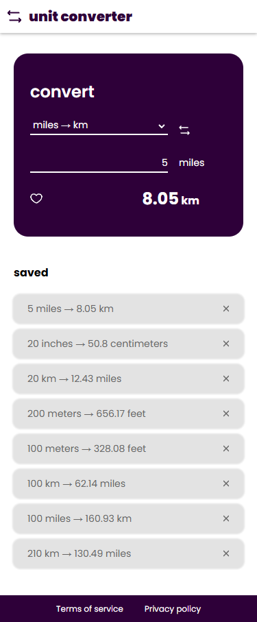
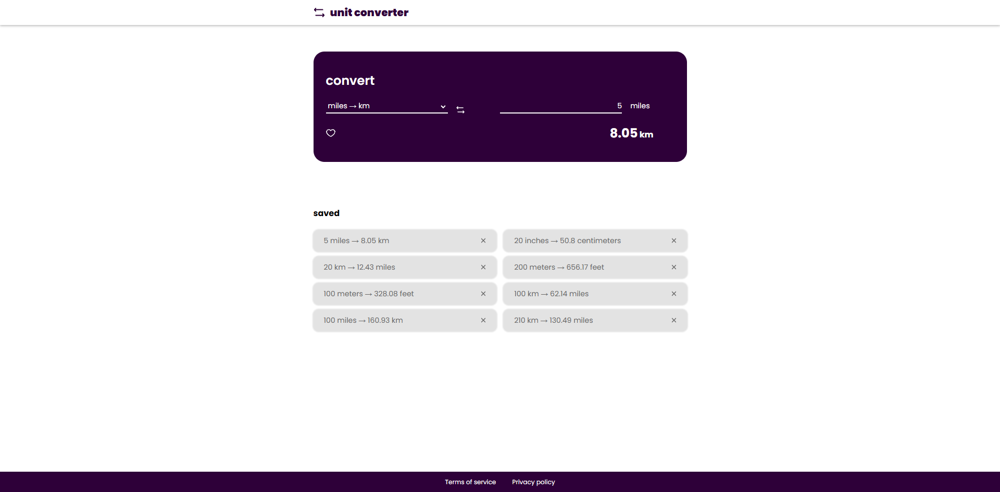

# 📐 Unit Converter - Oxygen (Technical Test)

Unit Converter is a tool designed to convert various units of measurement with ease and accuracy. This project was developed as part of a technical test for the **Oxygen Workspace Team**.

---

## 🖼 Screenshots





---

## 🚀 Tech Stack

This project is built using the following technologies:

- **Frontend**:

  - React
  - Redux Toolkit
  - Vite
  - SCSS
  - Framer Motion

- **Backend**:

  - Node.js
  - Express.js
  - MongoDB (with MongoDB Atlas)
  - Zod

---

## ✨ Features

- Convert between different units.
- User-friendly and intuitive interface.
- Wide range of supported units.
- Instant conversion results as you type.
- Save conversion results in the database.

---

## 📥 Installation & Setup

Follow these steps to set up and run the **Unit Converter** project on your local machine:

### 1️⃣ Clone the repository:

```sh
git clone https://github.com/jorgeoviedo3/unit-converter-oxygen.git
cd unit-converter-oxygen
```

### 2️⃣ Backend Setup (Server)

```sh
cd server
```

- Install dependencies:
  ```sh
  pnpm install
  ```
- Create an **.env** file (based on **.env.example**) and configure your environment variables:
  ```sh
  PORT=3000 # Choose any available port
  MONGODB_URI=your-mongodb-connection-string # Get this from MongoDB Atlas
  ```
- Start the backend server:
  ```sh
  pnpm run dev  # For development mode
  pnpm run start  # For production mode
  ```

### 3️⃣ Frontend Setup (Client)

```sh
cd ../client
```

- Install dependencies:
  ```sh
  pnpm install
  ```
- Create an **.env** file (based on **.env.example**) and configure it:
  ```sh
  VITE_BACKEND_URI=http://localhost:3000/api
  ```
  > **Note:** Ensure the port matches the one set in the backend `.env` and include `/api`.
- Start the frontend application:
  ```sh
  pnpm run dev # For development mode
  pnpm run start # For production mode
  ```

### 4️⃣ Open the app in your browser:

```sh
http://localhost:5173/
```

---

## 📌 Usage Guide

1. Open the application in your browser.
2. Choose the units for conversion (from → to).
3. Enter the value you want to convert.
4. View the converted result instantly.
5. Click the heart to save the converted result in the database.

---

## 📡 API Guide

The API provides several routes for interacting with unit conversions. Below are the available routes and how to use them:

### 1️⃣ **GET /api/conversions**

This route returns all the saved conversions from the database.

**Request:**

```http
GET /api/conversions
```

**Response:**

```json
[
  {
    "id": "60a76e5f0c9a2c3f4f33e3a1",
    "initialValue": 100,
    "initialUnit": "km",
    "resultValue": 62.14,
    "resultUnit": "miles",
    "createdAt": "2025-02-25T12:00:00Z"
  },
  {
    "id": "60a76e5f0c9a2c3f4f33e3a2",
    "initialValue": 50,
    "initialUnit": "meters",
    "resultValue": 164.04,
    "resultUnit": "feet"
    "createdAt": "2025-02-25T12:30:00Z"
  }
]
```

### 2️⃣ **POST /api/conversions**

This route allows you to add a new conversion to the database.

**Request:**

```http
POST /api/conversions
```

**Body:**

```json
{
  "initialValue": 50,
  "initialUnit": "meters",
  "resultValue": 164.04,
  "resultUnit": "feet"
}
```

**Schema for the body:**

```javascript
export const conversionsSchema = z.object({
  id: z.instanceof(ObjectId).optional(),
  initialValue: z.number().min(0.01, "Initial value must be at least 1"),
  initialUnit: z.string().min(2, "Initial unit must be at least 2 characters long"),
  resultValue: z.number().min(0.01, "Result value must be at least 1"),
  resultUnit: z.string().min(2, "Result unit must be at least 2 characters long"),
  createdAt: z.date().optional().default(new Date()),
});
```

**Response:**

```json
{
  "_id": "60a76e5f0c9a2c3f4f33e3a3",
  "initialValue": 50,
  "initialUnit": "meters",
  "resultValue": 164.04,
  "resultUnit": "feet",
  "createdAt": "2025-02-25T13:00:00Z"
}
```

### 3️⃣ **DELETE /api/conversions/:id**

This route allows you to delete a saved conversion by its `id`.

**Request:**

```http
DELETE /api/conversions/:id
```

**Example:**

```http
DELETE /api/conversions/60a76e5f0c9a2c3f4f33e3a1
```

**Response:**

```json
{
  "message": "Conversion deleted successfully"
}
```

---

## ➕ Adding More Methods and Units

To extend the application with additional unit conversions, you can add new conversion methods and units to the **unitsDictionary**. This will allow you to add support for more conversions..

### Steps to Add More Conversions:

1. **Locate the `unitsDictionary` inside `<Converter>` it will be in: /client/src/components/Converter.tsx**  
   It looks like this:

   ```javascript
   const unitsDictionary: {
     [key: string]: { from: string; to: string; method: (value: number) => number };
   } = { ... }
   ```

2. **Add a New Conversion Entry:**
   To add a new conversion, follow this structure:

   ```javascript
   newConversionKey: {
     from: "unitFrom",
     to: "unitTo",
     method: (value) => value * conversionRate,
   }
   ```

3. **Example: Adding a Conversion from km to cm and vice versa**
   To enable the "Flip" button, you need to define both directions of the conversion (e.g., km to cm and cm to km). Here's an example of how to add this conversion:

   ```javascript
   kilometerstocentimeters: {
     from: "kilometers",
     to: "centimeters",
     method: (km) => km * 100000,
   },
   centimeterstokilometers: {
     from: "centimeters",
     to: "kilometers",
     method: (cm) => cm / 100000,
   }
   ```

4. **Update the Units:**
   The front end is mapping this dictionary to show as an option in the select, so just add the objects to the dictionary and you're good to go.

With these steps, you can easily expand the tool’s conversion capabilities and allow users to convert between additional units. Remember to add both directions of the conversion to make the "Flip" button work correctly.

---

### 🎨 Changing Colors

You can customize the application's theme by modifying the **SCSS variables** inside the styles file.

#### Steps to Change Colors:

1. **Locate the SCSS file:**  
   The color variables are stored in your SCSS file. Open `index.scss` it will be located in /client/src.

2. **Modify the color variables:**  
   Change the values to match your preferred colors:

   ```scss
   $color-main: #2e0039; // Primary color (main theme)
   $color-secondary: #ffffff; // Secondary color (text)
   $color-tertiary: #676767; // Tertiary color (secondary text)
   $color-quaternary: #e3e3e3; // Quaternary color (secondary backgrounds)
   ```

---

## 📜 License

This project is licensed under the **MIT License**. See the [LICENSE](LICENSE) file for more details.
